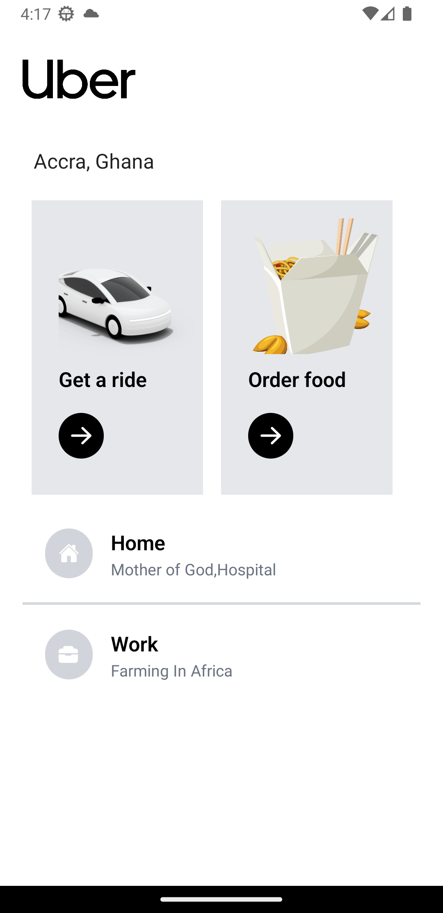
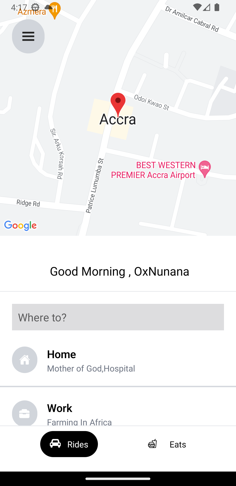
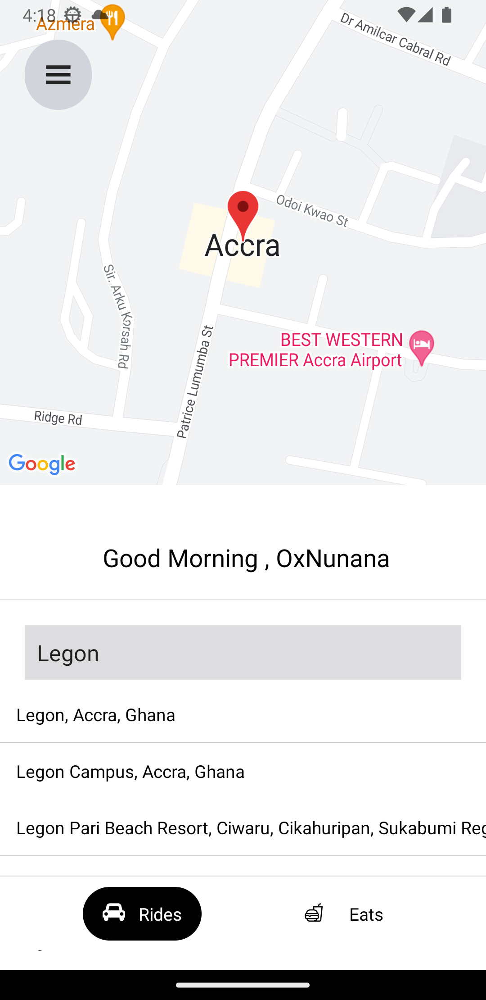
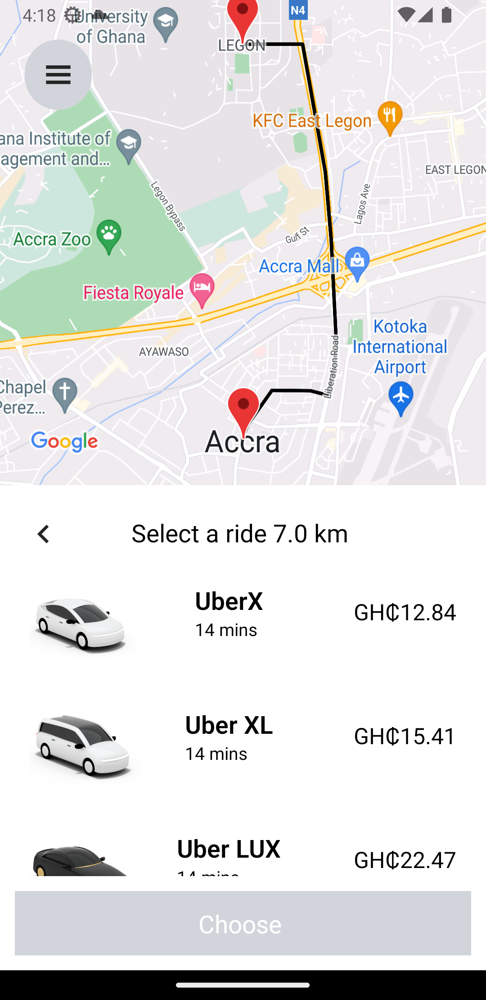
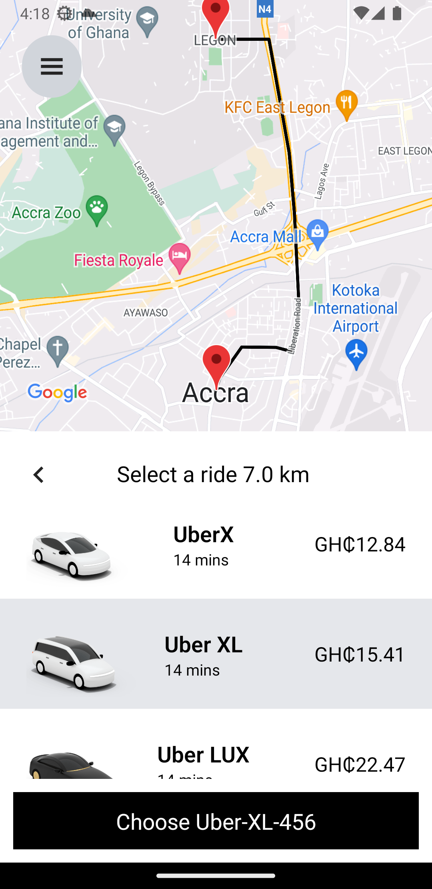

# Uber-clone

This mobile application is built with React Native and Javascript. It uses libraries such as react-native-maps,redux-toolkit, and Expo.

## Features

1. **Home Screen:** This is the initial screen where users can input their pickup location

2. **Search Screen:** Users can search for their destination
3. **Pricing Screen:** Users can choose their rides

## Technologies

- [React-native-google-places-autocomplete](https://github.com/FaridSafi/react-native-google-places-autocomplete):Customizable Google Places autocomplete component for iOS and Android React-Native apps
- [react-native-maps](https://github.com/react-native-maps/react-native-maps): This library provides the map functionality in the app.
- [React-native-maps-directions](https://github.com/bramus/react-native-maps-directions):Directions component for react-native-maps – Draw a route between two coordinates, powered by the Google Maps Directions API
- [Expo](https://expo.io/): An open-source platform for making universal native apps for Android, iOS, and the web with JavaScript and React.

## Installation

First, clone the repository:

git clone https://github.com/0xNunana/Uber-clone.git

Then, install the dependencies:
cd yourrepository
npm install

To start the Expo server, run:
expo start

## Preview
     
